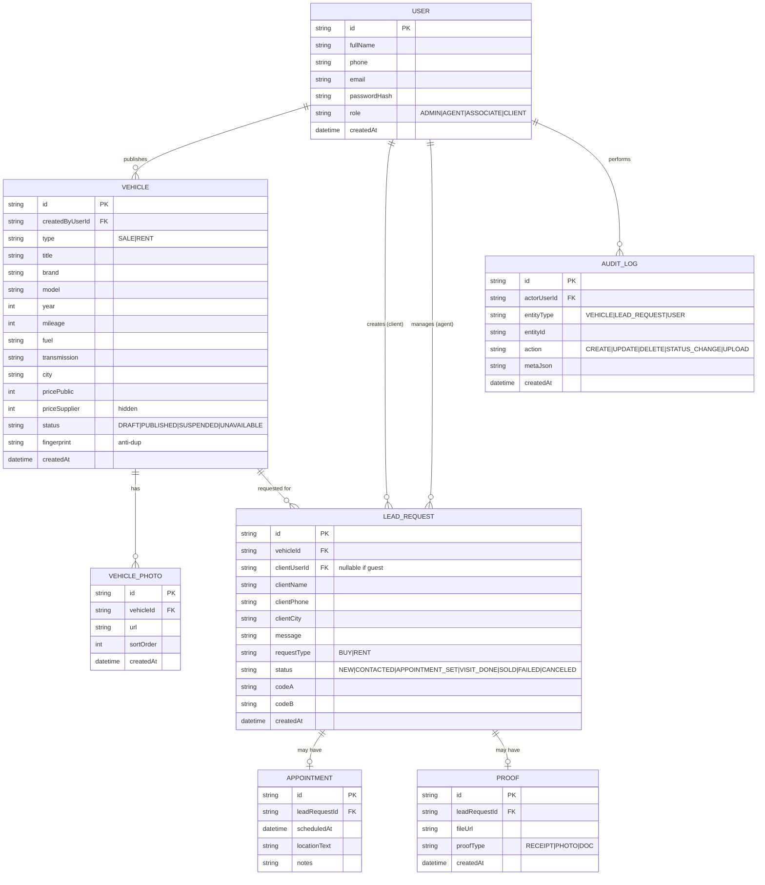

# DESCRIPTION DU PROJET:

# Cahier des charges — Marketplace véhicules (Vente & Location) — Modèle Courtier (O2O)

## 0) Résumé du projet (non technique)
Plateforme web où :
- Le **courtier (Abou)** publie des véhicules (photos + caractéristiques + prix public).
- Les **clients** consultent le catalogue et envoient une **demande** (achat ou location) sans paiement complet.
- La transaction se conclut **sur le terrain** (offline) mais doit être **traçable** dans la plateforme (codes, statuts, preuves, suivi client).
- Les **associés** ont un tableau de bord pour suivre la performance (leads, RDV, ventes, échecs).

## 1) Objectifs
### 1.1 Objectifs business
- Donner de la **visibilité** aux véhicules disponibles (vente/location).
- Centraliser les demandes clients et réduire les pertes d’opportunité.
- Assurer une **traçabilité** de l’activité d’Abou (suivi des leads → RDV → vente/échec).
- Permettre un pilotage entre associés : statistiques, transparence.

### 1.2 Objectifs produit (UX)
- Expérience client **ultra simple** : rechercher → voir détails → demander en 1 minute.
- Rassurer : photos, infos claires, statut, “avantage code”, contact rapide.
- Interface admin **très guidée** : publication de véhicule + suivi des demandes.

## 2) Acteurs & rôles
- **Visiteur** : consulte le catalogue, sans compte.
- **Client** : fait une demande (avec ou sans compte, à définir). Suit son statut.
- **Agent/Courtier (Abou)** : gère catalogue, demandes, RDV, clôture (vendu/échec), upload preuves.
- **Associé** : accès lecture aux dashboards + export + journaux.
- **Super Admin** : gestion des comptes, paramètres, modération.

## 3) Hypothèses & contraintes
- MVP sans paiement complet en ligne (option future : acompte).
- Hébergement VPS (Ubuntu 22/24) + Docker.
- DB : PostgreSQL recommandé (SQLite autorisé en dev).
- Auth : email + mot de passe (option : OTP WhatsApp/SMS).
- Communication : email (MVP), WhatsApp/SMS (phase 2).

---

# 4) Parcours utilisateur (workflow simple)

## 4.1 Parcours Client (Vente/Location)
1) Le client arrive sur la landing.
2) Il filtre (type vente/location, marque, budget, localisation).
3) Il ouvre la fiche véhicule.
4) Il clique :
   - “Commander pour acheter” ou “Réserver pour louer”
5) Il remplit un formulaire simple :
   - Nom, téléphone, ville, date souhaitée, message (optionnel)
6) Il reçoit une confirmation + un **Code A (Code de visite)**.
7) Il suit l’évolution (optionnel) : En attente → RDV programmé → Vendu/Échec.

## 4.2 Parcours Courtier (Abou)
1) Sur le terrain : photos + infos + prix fournisseur.
2) Sur le site (Espace Admin) :
   - Ajouter véhicule (prix fournisseur caché, prix public visible).
   - Publier → véhicule apparaît dans le catalogue.
3) Partage du lien (Facebook, groupes, pub) : bouton “Partager”.
4) Réception d’une demande client :
   - Notif + liste des demandes.
5) Abou contacte le client, fixe RDV → statut “RDV programmé”.
6) Après RDV :
   - Si vendu : saisit **Code B (clôture)** + upload preuve → statut “Vendu”.
   - Si non vendu : “Échec” + raison → système envoie enquête client automatique.

## 4.3 Parcours Associés (transparence)
- Accès dashboard : leads, RDV, ventes, taux de conversion, délais moyens.
- Accès au journal d’actions (audit log) : qui a changé quoi, quand.

---

# 5) Fonctionnalités (MVP)

## 5.1 Front public
- Landing page (proposition de valeur + CTA).
- Catalogue véhicules :
  - Filtres : type (vente/location), marque, prix min/max, ville, année, boîte, carburant
  - Tri : récent / prix / popularité
- Fiche véhicule :
  - Galerie photos, caractéristiques, prix public
  - CTA : Commander / Réserver
  - Mention “Avantage code” (réduction / service offert)
- Formulaire de demande (lead) :
  - Nom, téléphone, ville, disponibilité, message
  - Consentement (RGPD-like / conditions)
- Page “Merci” + rappel du code A.

## 5.2 Espace Client (minimal)
- Page de suivi par lien sécurisé (ou compte) :
  - Voir ses demandes & statuts

## 5.3 Back-office (Abou)
- Auth + profil
- Gestion catalogue :
  - CRUD véhicule
  - Gestion photos (upload)
  - Champs prix fournisseur (caché), prix public (visible)
  - Statut du véhicule : Brouillon / Publié / Suspendu / Indisponible
- Gestion des demandes :
  - Liste + détails
  - Statuts demande :
    - Nouveau → Contacté → RDV programmé → Visite effectuée → Vendu / Échec / Annulé
  - Saisie RDV (date/lieu)
  - Système **Code A / Code B**
  - Upload preuve si “Vendu”
  - Marge / commission interne (calcul automatique)

## 5.4 Espace Associés
- Dashboard global :
  - # véhicules publiés
  - # demandes reçues
  - # RDV programmés
  - # ventes clôturées
  - # échecs
  - taux de conversion
  - délai moyen (demande→contact, contact→RDV, RDV→clôture)
- Audit log :
  - changements de statuts
  - créations/suppressions
  - uploads preuves

## 5.5 Automatisations MVP
- Email de confirmation client (code A)
- Email interne à Abou (nouvelle demande)
- Relance client automatique (24–48h) si statut = “RDV programmé” ou “Visite effectuée” (option)

---

# 6) Traçabilité O2O (anti-faille) — règles produit

## 6.1 Double code
- Code A : attribué à la création de demande (visite)
- Code B : utilisé pour clôturer “Vendu”
  - Code B n’est délivré au client qu’après RDV programmé (ou après confirmation “j’ai vu le véhicule”).

## 6.2 Clôture Vendu
Pour passer une demande à “Vendu” :
- Code B obligatoire
- Preuve obligatoire (photo/document)
- Commission calculée (prix public - prix fournisseur)

## 6.3 Échec & déblocage
Si “Échec” :
- raison obligatoire
- envoi enquête client : “Avez-vous acheté ? Oui/Non”
- si client répond “Oui” alors qu’Abou a mis “Échec” ⇒ alerte associés

## 6.4 Anti-doublons (simple)
- Empreinte véhicule : marque + modèle + année + kilométrage + téléphone fournisseur (ou VIN partiel)
- Si empreinte déjà active ⇒ avertissement
- Quota véhicules actifs : ex. 20 max

---

# 7) Données & MCD (Modèle Conceptuel de Données)

## 7.1 Entités principales
- User (roles: ADMIN, AGENT, ASSOCIATE, CLIENT)
- Vehicle
- VehiclePhoto
- LeadRequest (demande)
- Appointment (RDV)
- Proof (preuve vente)
- AuditLog
- Supplier (optionnel MVP mais recommandé)

## 7.2 MCD (Mermaid ER)

## #### RAPPEL CREATION DB ET PEUPLEMENT DE LA DB
Pour rappel, la séquence à suivre quand tu supprimes la base est toujours : pnpm db:push (créer les tables) puis pnpm db:seed (remplir les données).